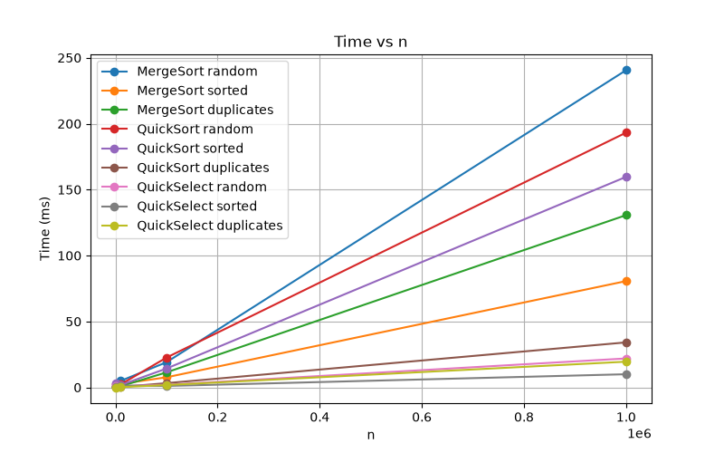
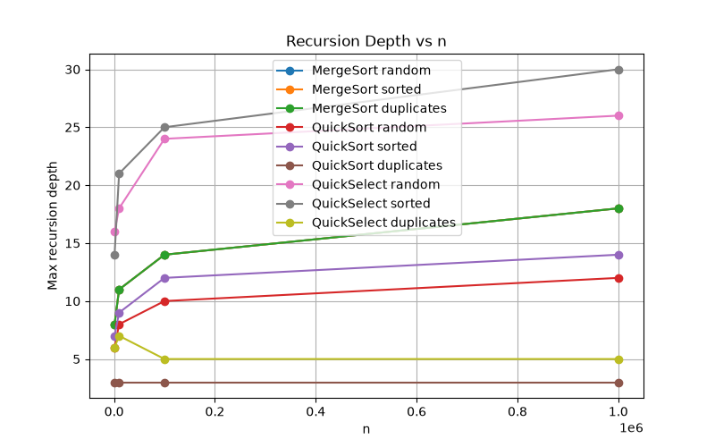
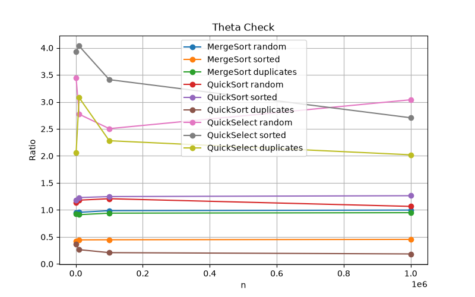

# DAA Assignment 1 - Divide and Conquer & Asymptotic Notations

## 1. Introduction

This assignment implements three Divide-and-Conquer algorithms in Java: MergeSort, QuickSort and QuickSelect. The algorithms were tested on large integer arrays with three input types: random, sorted and duplicates.

The main goal was to compare the practical performance of the algorithms with their theoretical time complexity. The benchmark measures execution time, number of comparisons and maximum recursion depth. Each test case was executed five times and the median time was saved in results.csv.

The project also includes JUnit 5 tests, benchmark results, plots and documentation.

## 2. Asymptotic Bounds

| Algorithm | Best Case | Average Case | Worst Case |
|---|---|---|---|
| MergeSort | Θ(n log n) | Θ(n log n) | Θ(n log n) |
| QuickSort | Ω(n log n) | Θ(n log n) | O(n²) |
| QuickSelect | Ω(n) | Θ(n) | O(n²) |
| Insertion Sort | Ω(n) | Θ(n²) | O(n²) |

### MergeSort

MergeSort divides the array into two parts and recursively sorts both parts. After that, the two sorted parts are merged in linear time. Because the array is always divided into approximately equal parts, the best, average and worst cases are Θ(n log n).

### QuickSort

The best case happens when the pivot divides the array into balanced parts. In this case the complexity is Ω(n log n). With a random pivot, the average complexity is Θ(n log n). The worst case is O(n²) when the pivot repeatedly creates very unbalanced partitions.

### QuickSelect

QuickSelect uses partitioning and continues only in the part that contains the required position k. With balanced partitions, the average complexity is Θ(n). In the worst case, if the pivot is repeatedly very bad, the complexity can become O(n²).

### Insertion Sort

Insertion Sort has a best-case complexity of Ω(n) when the array is already sorted. For random input, its average complexity is Θ(n²). The worst case is O(n²), for example when the array is sorted in reverse order.

## 3. Recurrence Relations

### MergeSort

MergeSort creates two subproblems of size n/2 and spends O(n) time merging them.

T(n) = 2T(n/2) + O(n)

Here:

a = 2

b = 2

f(n) = O(n)

Using the Master Theorem:

n^(log_b(a)) = n^(log_2(2)) = n

Therefore, this is Case 2 of the Master Theorem because f(n) = Θ(n).

The result is:

T(n) = Θ(n log n)

### QuickSort

For the recurrence analysis, we assume that the pivot creates two balanced partitions.

T(n) = 2T(n/2) + O(n)

Here:

a = 2

b = 2

f(n) = O(n)

We have:

n^(log_b(a)) = n^(log_2(2)) = n

This is Case 2 of the Master Theorem.

Therefore:

T(n) = Θ(n log n)

In the implementation, the pivot is selected randomly. A random pivot does not guarantee a balanced partition every time, but over many partitions the average behavior is close to balanced. Therefore, QuickSort has O(n log n) average running time.

### QuickSelect

For a balanced partition, QuickSelect continues with only one half of the array.

T(n) = T(n/2) + O(n)

Here:

a = 1

b = 2

f(n) = O(n)

We have:

n^(log_b(a)) = n^(log_2(1)) = 1

Since f(n) grows faster than this value, this is Case 3 of the Master Theorem.

Therefore:

T(n) = Θ(n)

QuickSelect is different from QuickSort because it does not recursively process both partitions. It only continues with the partition that contains k.

## 4. Implementation Details

### MergeSort

The MergeSort implementation uses one reusable helper array. The helper array is created only once in the top-level call and then passed through the recursive calls. This avoids creating new arrays during every merge operation.

A cutoff of 15 elements is also used. If a subarray contains 15 or fewer elements, Insertion Sort is used instead of continuing the recursive MergeSort process.

The merge operation processes both sorted halves using two pointers and therefore takes O(n) time.

### QuickSort

QuickSort uses a random pivot to reduce the chance of getting an O(n²) behavior on already sorted input.

The implementation uses three-way partitioning. The array is divided into three parts:

- values smaller than the pivot;
- values equal to the pivot;
- values greater than the pivot.

This is useful for arrays containing many duplicate values.

The algorithm also recursively processes the smaller partition and handles the larger partition using a while loop. This keeps the recursion depth approximately logarithmic and helps prevent StackOverflowError.

### QuickSelect

QuickSelect uses the same three-way partitioning method as QuickSort.

After partitioning, the algorithm checks the position k. If k is inside the smaller part, it continues there. If k is inside the equal part, the pivot value is returned. Otherwise, it continues in the larger part.

If the array is empty or k is outside the valid range, the method throws IllegalArgumentException with a clear error message.

## 5. Benchmark Setup

The benchmark uses the following input sizes:

1000

10000

100000

1000000

Three types of input arrays were tested:

- random - random integer values;
- sorted - already sorted values;
- duplicates - random values from 0 to 9.

Each algorithm was tested on every input type and every array size.

Each case was executed five times. The median execution time was used because the first JVM runs can be slower due to JVM warm-up and JIT compilation.

The results were saved in results.csv.

The CSV contains the following columns:

algorithm,input,n,time_ms,comparisons,max_depth

## 6. Time Results

The graph shows that the execution time increases as the input size increases. MergeSort has the expected n log n growth. QuickSort also shows approximately n log n behavior on average because of the random pivot.

QuickSelect usually requires less time because it does not sort the whole array. It only continues searching in the partition containing the required k-th element.

Different input types produce different execution times. This can be caused by the distribution of values, duplicate elements, random pivot choices, CPU cache behavior and JVM effects.

## 7. Recursion Depth Results

MergeSort has logarithmic recursion depth because the input is divided into two parts at every level.

QuickSort also has a relatively small recursion depth because the implementation recursively processes the smaller partition and handles the larger partition with a loop.

For the required test with 100000 sorted elements, the limit is:

2 * log2(100000) ≈ 33.2

The measured QuickSort recursion depth is much smaller than this value. Therefore, the depth requirement is satisfied.

This design also helps prevent StackOverflowError on large arrays.

QuickSelect has more variation in recursion depth because its depth depends on the selected pivots and the position of k.

## 8. Θ Check

For MergeSort and QuickSort, the ratio is calculated as:

comparisons / (n * log2(n))

For QuickSelect, the ratio is calculated as:

comparisons / n

The purpose of this ratio is to check whether the measured cost behaves like the expected asymptotic function.

If:

f(n) = Θ(g(n))

then for sufficiently large n, the ratio:

f(n) / g(n)

should stay within a relatively stable range.

The MergeSort ratios are relatively stable as n increases. This supports the theoretical Θ(n log n) complexity.

QuickSort has more variation because the pivot is selected randomly. However, the ratio does not continuously increase with n, which is consistent with the expected average Θ(n log n) behavior.

QuickSelect has more variation than MergeSort because its number of comparisons depends strongly on the selected pivot. The ratio remains within a limited range, which is consistent with approximately linear average behavior.

The experimental results support the theoretical complexity, but a finite benchmark cannot mathematically prove a Θ bound.

## 9. Experimental Θ Bounds

The definition of Θ is:

c1 * g(n) <= f(n) <= c2 * g(n)

for all n >= n0.

The experimental constants were estimated from the measured comparison ratios in results.csv. For MergeSort and QuickSort, the ratio is comparisons / (n * log2(n)). For QuickSelect, the ratio is comparisons / n.

Using the measurements with n >= 10,000, the following rough experimental bounds were obtained:

| Algorithm | Ratio | c1 | c2 | n0 |
|---|---|---:|---:|---:|
| MergeSort | comparisons / (n log2(n)) | 0.44 | 1.00 | 10,000 |
| QuickSort | comparisons / (n log2(n)) | 0.16 | 1.28 | 10,000 |
| QuickSelect | comparisons / n | 1.72 | 3.68 | 10,000 |

For MergeSort, the measured ratios after n = 10,000 stay approximately between 0.44 and 1.00. Therefore, the experimental data supports a Θ(n log n) comparison count.

For QuickSort, the ratio varies more because the pivot is selected randomly. The measured values after n = 10,000 are approximately between 0.16 and 1.28. The ratio does not systematically grow with n, which supports the expected average Θ(n log n) behavior.

For QuickSelect, the ratio comparisons / n stays approximately between 1.72 and 3.68 for n >= 10,000. This supports the expected average Θ(n) behavior.

These values are rough experimental estimates based on the collected benchmark data. They do not mathematically prove a Θ bound for every possible input size. They only show that the measured ratios become bounded and relatively stable for the tested large inputs.
## 10. Discussion

The benchmark results generally match the theoretical behavior of the algorithms. MergeSort provides stable performance because it always divides the input into two approximately equal parts. QuickSort shows more variation because the pivot is chosen randomly. The three-way partition makes QuickSort efficient when the input contains many duplicate values. QuickSelect is usually faster than a full sorting algorithm because it only processes one side of the partition. The recursion depth of QuickSort stays relatively small because the algorithm recursively processes the smaller side and uses a loop for the larger side. JVM warm-up can affect the first benchmark runs because Java uses JIT compilation to optimize frequently executed code. Garbage collection can also create small differences between measurements. CPU cache behavior can influence the execution time for different array sizes. The 15-element cutoff in MergeSort can improve practical performance because Insertion Sort is efficient for small arrays.

## 11. Testing

JUnit 5 was used to test the correctness of the algorithms.

The tests include:

- comparison of sorting results with Arrays.sort;
- random arrays;
- empty arrays;
- arrays with one element;
- arrays containing equal elements;
- already sorted arrays;
- QuickSort recursion depth;
- QuickSelect results compared with sorted arrays.

The test suite was successfully executed and all 8 tests passed.

The QuickSelect tests confirmed that the returned value matches the k-th element of the sorted reference array.

## 12. Conclusion

This assignment demonstrated the implementation and analysis of Divide-and-Conquer algorithms in Java.

MergeSort achieved the expected Θ(n log n) behavior and used a reusable buffer with an Insertion Sort cutoff. QuickSort used a random pivot, three-way partitioning and smaller-side recursion to achieve good average performance and bounded recursion depth. QuickSelect found the k-th smallest element without sorting the entire array.

The benchmark results, recursion depth measurements and ratio plots generally support the theoretical complexity of the algorithms. JUnit tests confirmed that the implementations produce correct results for random and edge-case inputs.

The project also demonstrated how theoretical algorithm analysis can be compared with real measurements using execution time, comparisons and recursion depth.